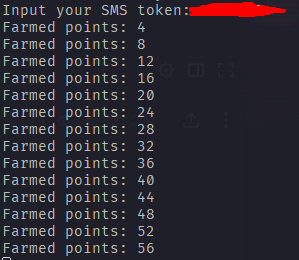

# GauPointFarmer
Um bot que farma Gaupoints do https://www.twitch.tv/gaules. Por enquanto só funciona para contas que possuem autenticação em dois fatores e no modo `headless: false`

# Ferramentas usadas
- [NodeJS](https://nodejs.org/en/download/)
- [Puppeter](https://pptr.dev/)

# Como usar
- Faça um clone do repositorio
- Rode um `npm install` ou `yarn`
- No arquivo `credentials.js` edite o campo `username` e `password`
- Abra o seu terminal na pasta do projeto e execute o comando `npm run start` ou `yarn start`
- Insira o SMS token no terminal
- Pronto, você já esta farmando pontos 😀
